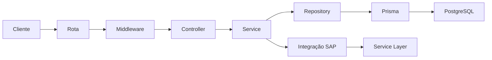
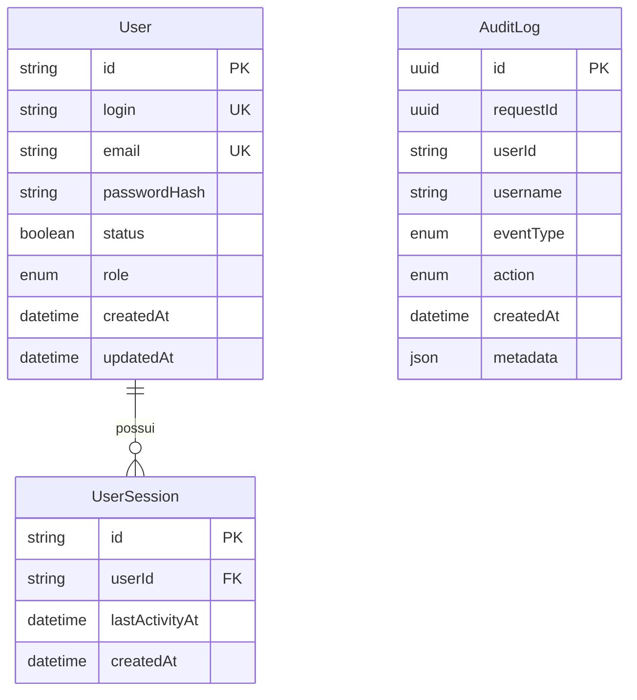

# Documentação — LPSHUB API Reports

Guia de instalação, operação e desenvolvimento da API. O conteúdo descreve os arquivos e comportamentos implementados no repositório; exemplos usam dados fictícios e não reproduzem os valores do `.env`.

> **Objetivo:** disponibilizar dados do SAP Business One para aplicações consumidoras, com autenticação, controle de acesso e rastreabilidade. O PostgreSQL armazena usuários, sessões e auditoria. Os relatórios são consultados no SAP.

## Sumário

- [1. Visão geral](#visao-geral)
- [2. Como inicializar](#inicializacao)
- [3. Dependências](#dependencias)
- [4. Configuração do ambiente](#ambiente)
- [5. Rotas e exemplos](#rotas)
- [6. Segurança](#seguranca)
- [7. Logs e auditoria](#auditoria)
- [8. Pastas, arquivos e responsabilidades](#pastas)
- [9. Banco de dados](#banco)
- [10. Integração com SAP](#sap)
- [11. Decisões de desenvolvimento](#decisoes)
- [12. Testes e manutenção](#manutencao)

<a id="visao-geral"></a>
## 1. Visão geral

A aplicação utiliza **Node.js, Express, JavaScript com ES Modules, PostgreSQL e Prisma**. Ela possui dois caminhos principais:



Por exemplo, o login consulta o PostgreSQL. A consulta de extrato valida a sessão no PostgreSQL, busca os lançamentos no SAP e registra a auditoria no PostgreSQL.

**Autenticação** identifica quem está acessando. **Autorização** verifica se essa pessoa pode executar a operação. Um usuário `USER` pode consultar relatórios, mas somente `ADM` pode cadastrar, listar ou desativar usuários e redefinir senhas.

As regras completas estão em [AGENTS.md](AGENTS.md). Os documentos especializados ficam em [docs/](docs/).

<a id="inicializacao"></a>
## 2. Como inicializar

### 2.1 Pré-requisitos

- Node.js e npm, com suporte às APIs nativas usadas pelo projeto, incluindo `fetch`, `node:test`, `AsyncLocalStorage` e `crypto.randomUUID()`.
- PostgreSQL acessível. O Compose do projeto utiliza a imagem `postgres:16-alpine`.
- Docker com Compose, caso utilize o banco fornecido pelo repositório.
- Credenciais e acesso de rede ao SAP para executar as rotas de integração.

O `package.json` não fixa uma versão de Node em `engines`. O ambiente usado no desenvolvimento desta documentação executa Node.js 24; isso não define, por si só, uma matriz completa de compatibilidade.

Execute os comandos abaixo na raiz do projeto, onde está o `package.json`.

### 2.2 Instalar pacotes e configurar o ambiente

```powershell
npm ci

# Copiar somente se o arquivo ainda não existir.
if (-not (Test-Path -LiteralPath .env)) {
    Copy-Item -LiteralPath .env.example -Destination .env
}
```

Preencha o `.env` local conforme a [seção de ambiente](#ambiente). O exemplo versionado contém marcadores, não credenciais válidas. `npm ci` instala as versões resolvidas no `package-lock.json`.

### 2.3 Iniciar e verificar o PostgreSQL

Para usar o serviço `lpshub` do Compose:

```powershell
docker compose up -d lpshub
docker compose ps
docker compose exec lpshub pg_isready
```

O Compose mapeia a porta `5438` do computador para `5432` do container. A `DATABASE_URL` precisa corresponder à porta, ao usuário, à senha e ao banco escolhidos no Compose. Os dados persistem no volume `lpshubReports`.

O arquivo Compose define sua própria configuração PostgreSQL. Ele não recebe automaticamente as credenciais contidas em `DATABASE_URL`. Não copie credenciais reais para documentação ou arquivos versionados.

`pg_isready` verifica se o servidor aceita conexões; não comprova, sozinho, que a credencial da API está correta ou que as tabelas existem.

### 2.4 Schema e Prisma Client

Para um banco já provisionado com o histórico compatível:

```powershell
npx prisma migrate status
npx prisma migrate deploy
npm run prisma:generate
```

- `migrate status`: consulta a situação das migrations.
- `migrate deploy`: aplica migrations pendentes já existentes no repositório.
- `prisma:generate`: gera o cliente JavaScript utilizado pela aplicação.

> **Limitação para banco completamente vazio:** o histórico atual contém `20260930075308_add_user_sessions`, que cria uma chave estrangeira para `User`, antes de `20260930120000_add_user_model`, que cria essa tabela. Pela ordem dos arquivos SQL, a aplicação integral das migrations em uma base vazia falha nessa dependência. É necessário corrigir o histórico por uma mudança específica antes de considerar a instalação do zero suportada. Não marque uma migration como aplicada se suas operações não foram realizadas.

No Windows, se a geração retornar `EPERM` no arquivo `query_engine-windows.dll.node`, encerre as instâncias desta API ou do Prisma Studio que estejam usando o cliente, gere novamente e reinicie o processo.

### 2.5 Iniciar a API

```powershell
npm run dev
```

O `nodemon` executa `src/server.js` e reinicia a API quando arquivos monitorados mudam. A porta vem de `PORT`; se essa variável estiver ausente, o código utiliza `3002`. O valor de exemplo em `.env.example` é uma configuração de referência e pode diferir desse fallback.

Para verificar, substitua `<PORTA>` pela porta usada no seu ambiente:

```http
GET http://localhost:<PORTA>/api
```

Resposta esperada:

```json
{ "message": "API funcionando" }
```

Esse endpoint confirma o atendimento HTTP da API. Ele não executa um diagnóstico completo do banco ou do SAP.

### 2.6 Preparar o administrador local com fullTest

Depois de preparar banco, tabelas e Prisma Client, configure as três variáveis `FULL_TEST_ADMIN_*` no `.env` e execute:

```powershell
npm run fullTest
```

O script:

1. Exige login, email e senha de preparação local.
2. Executa `SELECT 1` através do Prisma para conferir a conexão com o banco.
3. Faz `upsert` do usuário pelo login: cria ou atualiza email, hash da senha, papel `ADM` e status ativo.
4. Encerra a conexão Prisma usada pela preparação e inicia `npm run dev`.

**Cada execução reaplica a senha configurada e reativa a conta escolhida.** Esse comando deve apontar para o banco de desenvolvimento. Ele não inicia o PostgreSQL, não aplica migrations e não executa `npm test`.

O cadastro HTTP exige um administrador já autenticado; por isso essa preparação local atende à necessidade da primeira conta administrativa no ambiente de desenvolvimento.

### 2.7 Comandos disponíveis

| Comando | Finalidade |
| --- | --- |
| `npm run dev` | Iniciar com reinício automático pelo nodemon. |
| `npm start` | Executar `node src/server.js`, sem nodemon. |
| `npm test` | Executar os testes com `node --test`. |
| `npm run fullTest` | Conferir banco, preparar administrador local e iniciar o modo dev. |
| `npm run prisma:generate` | Gerar Prisma Client. |
| `npm run prisma:migrate -- --name nome_da_alteracao` | Criar/aplicar migration no desenvolvimento; o histórico deve estar consistente. |
| `npm run prisma:studio` | Abrir a interface de administração local do Prisma. |
| `npx prisma migrate deploy` | Aplicar migrations existentes em um banco com histórico compatível. |

`npm start` não define `NODE_ENV`. Para execução de produção, configure `NODE_ENV=production`, HTTPS/proxy, banco e secrets antes de iniciar. O servidor Node usa `app.listen`; ele não carrega certificados TLS diretamente. O bloqueio de HTTP não cria, sozinho, um servidor HTTPS.

<a id="dependencias"></a>
## 3. Dependências

### 3.1 Pacotes diretos do package.json

As faixas abaixo são as declaradas pelo projeto. O `^` permite atualizações compatíveis dentro da versão principal; as versões exatas e todas as dependências transitivas estão no [package-lock.json](package-lock.json).

| Pacote | Faixa | Grupo atual | O que faz na API |
| --- | --- | --- | --- |
| `express` | `^5.2.1` | Dependência | Servidor HTTP, routers, middlewares, parsing JSON e respostas. |
| `cors` | `^2.8.6` | Dependência | Configura os headers para origens autorizadas de frontend e uso de cookies. |
| `dotenv` | `^17.4.2` | Dependência | Carrega o arquivo `.env` para `process.env`. |
| `express-rate-limit` | `^8.7.0` | Dependência | Limita requisições por IP em janelas de tempo. |
| `helmet` | `^8.3.0` | Dependência | Aplica headers HTTP de segurança. |
| `pino` | `^10.4.0` | Dependência | Produz logs estruturados com contexto e redaction. |
| `pino-http` | `^11.0.0` | Dependência | Integra o Pino ao ciclo de requisição e resposta do Express. |
| `zod` | `^4.6.5` | Dependência | Valida o formato dos dados antes dos controllers. |
| `@prisma/client` | `^6.19.3` | Desenvolvimento | Cliente gerado que executa consultas PostgreSQL; também é necessário na execução da API. |
| `prisma` | `^6.19.3` | Desenvolvimento | CLI para schema, migrations, geração e Studio. |
| `nodemon` | `^3.1.14` | Desenvolvimento | Reinicia o processo ao detectar alterações locais. |
| `pino-pretty` | `^13.2.0` | Desenvolvimento | Formata os logs para leitura no terminal fora de produção e dos testes. |

> `@prisma/client` está declarado em `devDependencies`, embora seja importado em runtime. Com a classificação atual, uma instalação que omita todas as dependências de desenvolvimento pode deixar a API sem esse pacote. A preparação de deploy precisa garantir sua presença e a geração do cliente.

Não há dependências instaladas chamadas `bcrypt`, `jsonwebtoken` ou `cookie-parser`: senhas, JWT e leitura do cookie têm implementações próprias usando os recursos disponíveis no projeto.

### 3.2 Recursos nativos e infraestrutura

| Recurso | Uso |
| --- | --- |
| `node:crypto` | `scrypt`, salt aleatório, UUIDs, HMAC-SHA256, SHA-256 e comparação com `timingSafeEqual`. |
| `node:async_hooks` | `AsyncLocalStorage`, que preserva o contexto da requisição. |
| `node:perf_hooks` | Medição de duração com `performance.now()`. |
| `node:util` | `promisify` para usar o scrypt assíncrono com `await`. |
| `node:child_process` e `node:url` | Iniciar o modo dev no script local e identificar seu arquivo de entrada. |
| `node:test`, `node:assert/strict` | Execução e asserções dos testes. |
| `node:http`, `node:events`, `node:stream`, `node:timers/promises` | Servidores locais, captura de logs e controle assíncrono nos testes. |
| `fetch`, `AbortController`, `Buffer` | Chamadas SAP, cancelamento por timeout e tratamento de dados binários. |
| PostgreSQL | Persistência da aplicação. Não é um pacote npm. |
| SAP Business One Service Layer | Serviço externo que fornece filiais e extratos. |
| Docker/Compose | Alternativa para executar o PostgreSQL local. |

<a id="ambiente"></a>
## 4. Configuração do ambiente

O `.env` fica na raiz, é ignorado pelo Git e armazena a configuração do ambiente. O [.env.example](.env.example) documenta os nomes necessários sem credenciais reais.

**Os valores locais não são reproduzidos aqui.** Números de fallback descritos abaixo pertencem ao código, não são uma leitura dos valores secretos do ambiente.

| Variável | Finalidade | Comportamento e cuidados |
| --- | --- | --- |
| `PORT` | Porta HTTP da API. | Usada por `src/server.js`; fallback `3002` quando ausente. |
| `NODE_ENV` | Modo de execução. | O valor `production` ativa exigência de HTTPS, cookie `Secure` e logs JSON sem pretty. |
| `CORS_ALLOWED_ORIGINS` | Lista de origens de frontend. | Separadas por vírgula; protocolo, host e porta, sem caminhos, query, fragmentos ou credenciais. Lista vazia não libera origens externas. |
| `TRUST_PROXY` | Quantidade de saltos de proxy confiáveis. | Inteiro positivo ativa a confiança por distância; ausente, zero ou inválido desativa. O parser atual não aceita uma lista de IPs/CIDRs. |
| `JWT_SECRET` | Chave de assinatura dos JWTs. | O login exige pelo menos 32 caracteres. Deve ser uma chave imprevisível e secreta; comprimento sozinho não garante entropia. |
| `PASSWORD_RESET_DEFAULT` | Senha aplicada pela redefinição administrativa. | Fica no servidor e nunca integra a resposta de reset. Deve estar preenchida para essa operação. |
| `FULL_TEST_ADMIN_LOGIN` | Login da conta preparada pelo `fullTest`. | Obrigatória apenas nesse script; recebe `trim()`. |
| `FULL_TEST_ADMIN_EMAIL` | Email da conta preparada pelo `fullTest`. | Obrigatória no script; normalizada com `trim()` e letras minúsculas. |
| `FULL_TEST_ADMIN_PASSWORD` | Senha reaplicada pelo `fullTest`. | Obrigatória no script; convertida em hash antes da persistência. |
| `DATABASE_URL` | Conexão PostgreSQL do Prisma. | Contém protocolo, usuário, senha, servidor, porta e banco; mantenha toda a string em sigilo. |
| `SAP_SERVICE_LAYER_URL` | Endereço base do SAP. | A integração constrói os caminhos de `/b1s/v1/` a partir desse endereço. |
| `SAP_SERVICE_LAYER_COMPANY_DB` | Base de empresa utilizada no login SAP. | Não é o banco PostgreSQL da API. |
| `SAP_SERVICE_LAYER_USERNAME` | Usuário técnico do SAP. | Usado somente na comunicação servidor → SAP. |
| `SAP_SERVICE_LAYER_PASSWORD` | Senha técnica do SAP. | Usada somente no login externo; não deve chegar ao frontend ou aos logs. |
| `SAP_SERVICE_LAYER_TIMEOUT_MS` | Timeout de cada chamada HTTP ao SAP, em milissegundos. | Um inteiro positivo substitui o fallback de código de `300000` ms, ou cinco minutos. |

Exemplo **fictício** de sintaxe para CORS:

```dotenv
CORS_ALLOWED_ORIGINS=http://localhost:3000,http://localhost:3001
```

Uma origem é a combinação de protocolo, host e porta. `http://localhost:3000` e `http://localhost:3001` são origens distintas.

Estrutura conceitual da conexão, sem valores utilizáveis:

```text
postgresql://<USUARIO>:<SENHA>@<HOST>:<PORTA>/<BANCO>
```

Se criar uma variável em `.env.example`, ela também deve ser incluída no `.env` local, conforme a regra do projeto, mantendo os valores reais fora do versionamento.

`NODE_TEST_CONTEXT` aparece no código como indicador interno do executor de testes Node; não é uma configuração que deva ser adicionada manualmente ao `.env`. Não há variáveis implementadas para alterar os timeouts de sessão, limites de requisição ou nível de log: esses parâmetros estão no código.

<a id="rotas"></a>
## 5. Rotas e exemplos

### 5.1 Convenções de uso

- Base local: `http://localhost:<PORTA>`; em produção, utilize o endereço HTTPS configurado.
- Envie `Content-Type: application/json` nas operações com body JSON.
- Não existem parâmetros dinâmicos de caminho nas rotas atuais. Queries não previstas são rejeitadas pelo Zod.
- Rotas protegidas recebem o cookie `lpshub_access_token`, emitido no login.
- Não há suporte implementado a autenticação por `Authorization: Bearer` nessas rotas.
- O header `X-Request-ID` permite correlacionar a resposta com os logs.

| Método | Caminho | Acesso | AuditAction da operação |
| --- | --- | --- | --- |
| GET | `/api` | Público | `API_STATUS_CHECK` |
| GET | `/health` | Usuário ativo autenticado | `HEALTH_CHECK` |
| POST | `/api/v1/auth/login` | Público | `AUTHENTICATE` |
| GET | `/api/v1/auth/me` | Usuário ativo autenticado | `VIEW_CURRENT_USER` |
| POST | `/api/v1/auth/logout` | Usuário ativo autenticado | `LOGOUT` |
| POST | `/api/v1/auth/register` | ADM | `CREATE_USER` |
| GET | `/api/v1/auth/users` | ADM | `LIST_USERS` |
| POST | `/api/v1/auth/password-reset` | ADM | `RESET_USER_PASSWORD` |
| POST | `/api/v1/auth/deactivate` | ADM | `DISABLE_USER` |
| GET | `/api/v1/filiais` | Usuário ativo autenticado | `BRANCH_LIST` |
| POST | `/api/v1/extratos-bancarios` | Usuário ativo autenticado | `BANK_STATEMENT_SEARCH` |
| GET | `/api/v1/service-layer` | Usuário ativo autenticado | `CHECK_SERVICE_LAYER_CONNECTION` |

Essas são as **12 rotas explícitas** do catálogo atual. O Express/CORS também pode responder automaticamente a métodos de protocolo, como `HEAD` para GET e preflight `OPTIONS`; eles não constituem novos endpoints de negócio.

### 5.2 GET /api

Verificação pública de disponibilidade HTTP. Sem body, query ou cookie obrigatório.

**200:**

```json
{ "message": "API funcionando" }
```

Não testa conectividade SAP. A auditoria global continua participando do atendimento.

### 5.3 GET /health

Verificação de disponibilidade protegida por autenticação. Como passa por `authenticate`, depende também da validação de usuário e sessão no banco. Não consulta o SAP.

**200:**

```json
{ "status": "ok", "message": "API online" }
```

### 5.4 POST /api/v1/auth/login

Recebe login e senha, procura a conta, compara a senha com o hash armazenado e exige usuário ativo. Em sucesso, cria uma `UserSession`, assina um JWT e envia o cookie.

```json
{
  "login": "jpereira",
  "senha": "<SENHA_INFORMADA_PELO_USUARIO>"
}
```

**200:** `{ "success": true, "data": { ...campos públicos do usuário... } }` e header `Set-Cookie`. O token não é retornado em JSON.

Os campos públicos são `id`, `login`, `email`, `status`, `role`, `createdAt` e `updatedAt`. Datas são serializadas como strings ISO.

**401 `INVALID_CREDENTIALS`:** mensagem genérica `Login ou senha inválidos.` para conta inexistente, inativa ou senha incorreta. **500 `AUTH_CONFIGURATION_ERROR`:** chave JWT ausente ou insuficiente. Body inválido gera **400**. Limite adicional: **15 pedidos/minuto por IP**.

O login é recebido pronto: a API não transforma um nome completo em iniciais. Ela remove espaços nas extremidades do login e normaliza emails para minúsculas nas operações que os utilizam.

### 5.5 GET /api/v1/auth/me

Valida o cookie e informa o dono da sessão atual. Sem body ou filtros.

**200**, exemplo fictício:

```json
{
  "success": true,
  "data": {
    "id": "identificador-ficticio",
    "login": "jpereira",
    "email": "jpereira@example.com"
  }
}
```

Não retorna papel, senha, hash ou identificador de sessão.

### 5.6 POST /api/v1/auth/logout

Recebe somente o cookie, sem body de negócio. Exclui a `UserSession` correspondente ao cookie atual e manda o navegador removê-lo.

**200:**

```json
{ "success": true }
```

Outras sessões da mesma conta permanecem ativas. Um body com `login` ou outros campos não é aceito. O esquema vazio permite ausência de body ou `{}`. Uma sessão já inválida não executa novamente o logout com sucesso.

### 5.7 POST /api/v1/auth/register

Somente **ADM**. Cadastra um usuário ativo com papel **USER**, independentemente do papel do administrador que fez o pedido.

```json
{
  "login": "jpereira",
  "email": "jpereira@example.com",
  "senha": "<SENHA_ESCOLHIDA>"
}
```

**201:** `{ "success": true, "data": { ...campos públicos do usuário... } }`.

Login e email devem ser únicos. Conflito retorna **409 `USER_ALREADY_EXISTS`**. Não envie `role`, `status` ou `passwordHash`: campos extras são rejeitados. Limite adicional: **15 pedidos/minuto por IP**.

### 5.8 GET /api/v1/auth/users

Somente **ADM**. Lista usuários, ativos e inativos, ordenados por login.

**200:** `{ "success": true, "data": [] }`, sendo `data` um array dos campos públicos definidos na seção de login.

A seleção do banco exclui `passwordHash` e sessões. A listagem atual não tem paginação nem filtros por query.

### 5.9 POST /api/v1/auth/password-reset

Somente **ADM**. Procura uma conta pelo par login/email e grava um novo hash da senha definida em `PASSWORD_RESET_DEFAULT`.

```json
{
  "login": "jpereira",
  "email": "jpereira@example.com"
}
```

**200:** dados públicos da conta atualizada. A senha não é enviada na resposta. **404 `USER_NOT_FOUND`:** par login/email não encontrado. Limite adicional: **5 pedidos/minuto por IP**.

Não recebe uma nova senha pelo body e não implementa fluxo de recuperação por email. A implementação atual também não exclui as sessões existentes ao redefinir a senha.

### 5.10 POST /api/v1/auth/deactivate

Somente **ADM**. Desativa a conta e exclui todas as suas sessões em uma transação.

```json
{ "login": "jpereira" }
```

**200:** dados públicos com `status: false`. **404 `USER_NOT_FOUND`:** login inexistente.

Se o administrador desativar a própria conta, a resposta também remove seu cookie. Nos outros navegadores, a próxima requisição protegida encontra a sessão inválida. Não existe uma rota de reativação no catálogo atual.

### 5.11 GET /api/v1/filiais

Consulta `SQLQueries('LpsHub-GetDadosFiliais')/List` no SAP. Faz login externo, percorre as páginas indicadas por `odata.nextLink`, reúne os registros e encerra a sessão.

**200**, exemplo fictício de campos devolvidos pela consulta SAP:

```json
{
  "success": true,
  "data": [{ "IDSAP": 1, "Nome Empresa": "Empresa de exemplo", "Sigla": "DEMO" }]
}
```

A estrutura dos registros vem da consulta configurada no SAP, com remoção dos campos sensíveis reconhecidos pela integração. Não há query ou body de filtros nessa rota.

### 5.12 POST /api/v1/extratos-bancarios

Consulta `BankPages` no SAP com filtros de empresa e datas.

**Por intervalo:**

```json
{
  "empresa": ["DEMO", "EXEMPLO"],
  "dataInicial": "2026-04-01",
  "dataFinal": "2026-04-30"
}
```

**Por dias específicos:**

```json
{
  "empresa": ["DEMO"],
  "datas": ["2026-04-01", "2026-04-05"]
}
```

| Campo | Regra |
| --- | --- |
| `empresa` | Array obrigatório com pelo menos um texto não vazio. |
| `datas` | Array opcional de datas válidas no formato `AAAA-MM-DD`. Quando não vazio, tem prioridade sobre o intervalo. |
| `dataInicial` | Obrigatória quando não houver `datas` não vazio. |
| `dataFinal` | Obrigatória no modo intervalo e maior ou igual à inicial. |

O array `datas: []` segue o modo intervalo. Se datas de intervalo também forem enviadas, seus formatos ainda passam pelo Zod, mesmo que `datas` tenha prioridade. Os textos de empresa viram filtros `endswith(AccountName, ...)`, unidos por `or`. As datas específicas viram `DueDate eq ...`, também unidas por `or`; o intervalo usa limites inclusivos.

**200:** `{ "success": true, "data": [] }`, com os lançamentos retornados pelo SAP. Todas as páginas externas são reunidas antes da resposta; não há paginação HTTP exposta ao consumidor. Body máximo: **10 KB**.

A validação atual confere formato dos filtros; não existe uma lista implementada de empresas permitidas por usuário.

### 5.13 GET /api/v1/service-layer

Confirma comunicação e autenticação no SAP mediante **Login → Logout**. Não consulta um relatório e não retorna a sessão externa.

**200:**

```json
{ "message": "Service Layer funcionando" }
```

Somente retorna sucesso se o login produzir sessão utilizável e o logout concluir. Também exige autenticação da API.

### 5.14 Erros compartilhados

| HTTP / código | Significado |
| --- | --- |
| `400 INVALID_REQUEST` | Zod rejeitou body, query, params ou o header de cookie exigido. |
| `400 INVALID_JSON` | Body JSON malformado nas rotas com parser JSON. |
| `401 UNAUTHENTICATED` | Cookie/token inválido, sessão ausente/expirada ou usuário sem acesso ativo. |
| `403 FORBIDDEN` | Usuário autenticado sem papel ADM para a operação. |
| `403 HTTPS_REQUIRED` | HTTP não é aceito no modo de produção. |
| `413 PAYLOAD_TOO_LARGE` | Body excedeu o limite do parser. |
| `429 RATE_LIMIT_EXCEEDED` | Limite de requisições excedido. |
| `500 INTERNAL_ERROR` | Falha inesperada, com mensagem genérica ao cliente. |
| `500 SAP_CONFIGURATION_ERROR` | Configuração SAP incompleta. |
| `502 SAP_CONNECTION_ERROR` / `SAP_TIMEOUT` | Falha de comunicação com o SAP ou timeout. |
| `502 SAP_REQUEST_ERROR` | SAP respondeu a uma chamada com status HTTP de falha. |
| `502 SAP_SESSION_ERROR` | Login SAP não forneceu uma sessão utilizável. |
| `502 SAP_RESPONSE_ERROR` / `SAP_PAGINATION_ERROR` | Formato inesperado de registros, paginação repetida ou URL externa indevida. |

**Detalhe do fluxo atual:** um header Cookie ausente, ou sem o nome esperado, é rejeitado pelo Zod antes do `authenticate` e retorna **400**. Um cookie com nome correto, mas token inválido, chega à autenticação e retorna **401**. Assim, cookie ausente e inválido não possuem necessariamente o mesmo status.

Exemplo de erro de validação:

```json
{
  "success": false,
  "error": {
    "code": "INVALID_REQUEST",
    "message": "Dados da requisição inválidos.",
    "details": [{
      "location": "body",
      "path": "email",
      "code": "invalid_format",
      "message": "O campo EMAIL deve conter um e-mail válido."
    }]
  }
}
```

### 5.15 Uso pelo frontend

Exemplo ilustrativo de consulta após o login, com `API_BASE` definido pela configuração do frontend:

```js
const response = await fetch(`${API_BASE}/api/v1/auth/me`, {
  credentials: "include"
});
const payload = await response.json();
```

Use `credentials: "include"` também no login quando a chamada ocorrer entre origens. O navegador gerencia o cookie; o JavaScript não deve tentar ler seu conteúdo. CORS e `SameSite` são controles diferentes: liberar uma origem no CORS não faz um cookie `SameSite=Strict` ser enviado entre sites distintos.

<a id="seguranca"></a>
## 6. Segurança

### 6.1 Fluxo de proteção

```text
Request
  → requestContext: UUID e contexto assíncrono
  → Pino HTTP e auditoria global
  → Helmet e CORS
  → HTTPS obrigatório em produção
  → rate limit global
  → parser JSON com limite e validação global de query/params
  → limite específico da rota, quando existir
  → Zod da rota
  → authenticate, exceto login e GET /api
  → requireAdmin, quando necessário
  → controller → service → repository/integração
  → resposta e finalização da auditoria
```

Os limites específicos executam antes do Zod de body da rota. O parser JSON e a validação global já foram executados nesse ponto. Não se deve interpretar o fluxo resumido como ausência de qualquer processamento antes do rate limiter específico.

### 6.2 Auth: JWT associado a sessão no servidor

O JWT é criado em `src/utils/jwtUtils.js`, com assinatura **HS256/HMAC-SHA256**. Ele carrega `sub` (ID do usuário), `role`, `sid` (ID da sessão), `iat` e `exp`.

A assinatura permite detectar alterações. **JWT assinado não significa JWT criptografado:** o payload usa Base64URL e não deve conter secrets. A verificação valida estrutura, assinatura, algoritmo, campos necessários e expiração.

O middleware lê o JWT do cookie e consulta usuário e sessão no banco. Confere se a sessão pertence ao usuário, se a conta está ativa e se os prazos ainda são válidos. A autorização ADM usa o papel atual retornado pelo banco.

Cada login cria um ID com `crypto.randomUUID()`. Na implementação atual, esse ID é armazenado diretamente em `UserSession.id` e consultado pelo valor de `sid`. **O hash SHA-256 é usado em `AuditLog.sessionReference`; a busca da sessão não é feita por hash.** Não existe coluna `revokedAt`: remover a sessão do banco é o mecanismo de revogação.

### 6.3 Senhas e hashes

Senhas usam `crypto.scrypt` assíncrono, com **salt aleatório de 16 bytes** e **chave derivada de 64 bytes**. O formato persistido é:

```text
scrypt$<salt_em_hexadecimal>$<hash_em_hexadecimal>
```

O salt faz senhas iguais produzirem resultados armazenados diferentes. Na verificação, o scrypt é executado novamente e os resultados são comparados com `timingSafeEqual`. O hash não é uma senha cifrada que a API consiga descriptografar.

A validação de senha atual exige texto não vazio. Não há uma política implementada de tamanho mínimo maior, complexidade, histórico ou troca obrigatória após reset. A resposta genérica do login evita informar diretamente se a conta existe, mas não representa uma garantia de igualdade de tempo entre todos os cenários.

> O `AGENTS.md` ainda menciona bcrypt. A escolha posterior definida para a autenticação foi `crypto.scrypt`, registrada em `docs/business-rules.md` (REG-021) e implementada em `passwordUtils.js`. Esta documentação explica essa escolha efetiva; não declara bcrypt como dependência existente.

### 6.4 Cookie

| Propriedade | Função |
| --- | --- |
| `HttpOnly` | Impede que scripts do navegador leiam o cookie por `document.cookie`. |
| `Secure` em produção | Restringe o envio a conexões HTTPS. Desativado em desenvolvimento para permitir HTTP local. |
| `SameSite=Strict` | Restringe o envio do cookie em requisições entre sites, reduzindo exposição a CSRF. |
| `Path=/` | Disponibiliza o cookie aos caminhos da API nesse host. |
| Sem `Domain` explícito | Mantém o cookie restrito ao host que o definiu. |
| `maxAge` de oito horas | Define a validade do cookie emitido no login. |

O logout usa os mesmos atributos relevantes para remover o cookie. Não há middleware separado de token CSRF nem MFA implementado. `HttpOnly`, Helmet e SameSite não substituem validação e tratamento seguro de conteúdo no frontend.

### 6.5 Timeouts

| Controle | Limite | Efeito |
| --- | --- | --- |
| Inatividade da sessão | Duas horas | Uma sessão verificada após esse intervalo sem atividade é invalidada. |
| Duração absoluta | Oito horas desde a criação | Atividade contínua não ultrapassa esse teto. |
| JWT e cookie | Oito horas | Expiração definida no login. |
| Chamada HTTP SAP | Configuração em milissegundos; fallback de cinco minutos | `AbortController` interrompe a chamada quando o prazo é excedido. |

Exemplo: login às 08h e uso contínuo exigem nova autenticação às 16h pelo limite absoluto. Se a última atividade for às 10h, uma requisição às 12h já atinge o limite de inatividade.

O `lastActivityAt` é atualizado durante `authenticate`, antes do controller. Portanto, isso indica autenticação válida, não necessariamente sucesso final da operação: uma consulta SAP que falhe posteriormente também pode ter renovado a atividade.

A expiração é conferida nas requisições; não existe tarefa periódica de limpeza de sessões. Um JWT expirado pode ser recusado antes da consulta ao banco, deixando o registro de sessão armazenado, embora ele não autorize acesso. O prazo SAP é por chamada: login, cada página e logout possuem suas próprias esperas; ele não é um limite único do relatório inteiro.

### 6.6 HTTPS e proxy reverso

Em produção, `req.secure` precisa indicar HTTPS. Sem isso, a API responde `403 HTTPS_REQUIRED`. Um proxy reverso pode receber HTTPS do cliente, terminar TLS e encaminhar a requisição ao Node.

```text
Cliente → HTTPS → proxy confiável → API Node
```

`TRUST_PROXY` informa quantos saltos podem ser considerados confiáveis para interpretar informações encaminhadas, como IP e protocolo. Sem proxy, mantenha a confiança desativada. Com proxy, o número deve refletir a topologia real.

O código atual configura confiança **por quantidade de saltos**, não por identidade de IP. Por isso, uma rota direta para o Node ou caminhos de rede com quantidades diferentes de proxies podem permitir interpretação indevida de headers. O proxy deve normalizar os headers encaminhados e o acesso ao Node precisa respeitar essa topologia. Não copie um número de outro ambiente sem conferir o caminho de rede.

### 6.7 Helmet, CORS e validação

**Helmet:** adiciona headers, incluindo proteções para enquadramento de páginas, MIME sniffing e política de conteúdo. Isso reduz riscos de clickjacking e de execução de conteúdo indevido em navegadores; não sanitiza HTML nem elimina toda possibilidade de XSS.

**CORS:** compara a origem com a lista configurada e habilita credenciais. Não utiliza `*`. Uma origem não cadastrada não recebe autorização CORS do servidor. CORS é aplicado pelos navegadores e não substitui autenticação, firewall ou controle de acesso para clientes HTTP em geral.

**Zod:** valida bodies conhecidos, query, params e header de cookie antes do controller. Objetos de body usam schema estrito para rejeitar campos extras. Login/email/senha têm regras de formato; filtros de data verificam se o dia realmente existe. Os GETs não possuem parser de body: não há contrato de conteúdo no corpo para essas consultas, nem uma promessa de validação de bytes arbitrários enviados por clientes fora desse contrato.

**Limite de body:** JSON de autenticação usa **2 KB**; extratos usam **10 KB**. Isso limita a entrada que os parsers processam. Não existe um limite geral implementado para o tamanho da resposta de relatórios.

**Express:** desativa `X-Powered-By`, configura confiança no proxy, aplica middlewares e encaminha falhas ao tratamento centralizado.

### 6.8 Limitação de requisições

| Escopo | Limite por IP |
| --- | --- |
| Global | 50 pedidos por minuto. |
| Login | 15 pedidos por minuto, além do global. |
| Cadastro | 15 pedidos por minuto, além do global. |
| Redefinição de senha | 5 pedidos por minuto, além do global. |

O excesso retorna `429 RATE_LIMIT_EXCEEDED`. Os contadores usam o armazenamento em memória padrão do limiter; não há store compartilhado configurado entre várias instâncias. Os limites por IP também podem ser compartilhados por usuários atrás do mesmo NAT/proxy.

### 6.9 Proteção de dados e erros

Respostas públicas de usuário excluem senha, hash e sessões. A integração SAP remove recursivamente os nomes de campos sensíveis conhecidos antes de devolver os registros. Esse filtro é uma lista explícita; novos campos sensíveis precisam ser incorporados quando aparecerem.

`AppError` carrega status e código controlados. O middleware global retorna erros conhecidos sem expor credenciais e usa mensagem genérica para falhas inesperadas. Stack traces não são incluídos nas respostas HTTP. O Pino mantém diagnósticos internos, com os limites de redaction explicados a seguir.

<a id="auditoria"></a>
## 7. Logs e auditoria

### 7.1 Pino: operação da aplicação

O Pino informa inicialização, falhas, status HTTP e duração. `pino-http` integra esses dados às requisições. Respostas `4xx` usam nível `warn`; falhas `5xx` usam `error`. A inicialização malsucedida gera log `fatal`.

Requisições com duração a partir de **um segundo** geram `HTTP_SLOW_REQUEST`. Códigos `SAP_` recebem `errorSource: "sap"`; os demais são classificados como `application`.

O JSON do logger utiliza timestamps ISO. Fora de produção e dos testes, `pino-pretty` formata a apresentação com horário do sistema em um transport. Não confunda a apresentação local do terminal com o armazenamento UTC da auditoria.

### 7.2 Request ID e AsyncLocalStorage

`requestContext` gera `crypto.randomUUID()` para cada requisição e devolve `X-Request-ID`. Um identificador enviado pelo cliente não substitui esse valor.

`AsyncLocalStorage` preserva `requestId`, `userId`, `sessionId` e `ip` ao longo da execução assíncrona. Assim, services e repositories conseguem acessar o contexto sem receber todos esses dados em cada chamada. O `sessionId` fica fora do contexto automaticamente serializado pelo logger.

### 7.3 Redaction e conteúdo permitido

O logger não serializa bodies, queries ou headers completos. A configuração remove caminhos sensíveis conhecidos, como `password`, `senha`, `authorization`, `cookie`, `token`, `sessionId`, `apiKey`, `secret` e `DATABASE_URL`.

Redaction por caminhos não identifica automaticamente um secret embutido dentro de texto livre. Mensagens e stacks também precisam ser produzidos com cuidado. O script `fullTest` ainda possui `console.log`/`console.error`; a padronização Pino está no fluxo operacional HTTP e no servidor, não em absolutamente toda saída do repositório.

### 7.4 AuditLog: trilha de ações

O fluxo é `requestContext → pino-http → audit → auditService → auditRepository → Prisma → AuditLog`.

Uma requisição gera dois registros com finalidades diferentes:

- **Operacional:** método, caminho, status e tempo para diagnóstico.
- **Auditoria:** ator, ação semântica, origem, momento e resultado para reconstruir o que ocorreu.

Cada rota é registrada em `AUDITED_ROUTES`. Eventos e ações são listas fechadas, espelhadas no schema Prisma e em `auditEvents.js`. Login e logout registram eventos explícitos no `authService`. Erros de autorização/validação podem trocar a ação da rota por `AUTHORIZE_ACCESS` ou `VALIDATE_REQUEST`; falhas SAP usam `EXTERNAL_API_ERROR` e preservam a ação de negócio quando disponível.

Exemplo **ilustrativo**, sem registros financeiros:

```json
{
  "eventType": "REPORT_EXECUTED",
  "action": "BANK_STATEMENT_SEARCH",
  "targetSystem": "SAP_B1",
  "success": true,
  "statusCode": 200,
  "responseCount": 120,
  "metadata": {
    "empresaCount": 2,
    "dateCount": 0,
    "dateStart": "2026-04-01",
    "dateEnd": "2026-04-30",
    "responseSizeBytes": 25000
  }
}
```

O metadata aceita somente campos da allow-list do evento e valores primitivos. A referência de sessão é SHA-256; não guarda o ID puro. Request e response completos não são copiados para a tabela.

As rotas comuns aguardam a tentativa de persistência antes de concluir a resposta. Login e logout respondem sem aguardar o INSERT. Se a gravação falhar, a implementação registra `AUDIT_PERSISTENCE_FAILED` e libera a resposta original; não há fila durável ou retry configurado. Portanto, a arquitetura tenta registrar cada requisição, mas não garante ausência de perda de eventos em falhas de persistência/processo.

O repository de auditoria expõe apenas inserção: **append-only no código da aplicação**. As migrations atuais não configuram grants/triggers para impedir alterações por credenciais administrativas. Não existe endpoint de consulta da auditoria, retenção automatizada ou `responseHash` implementado. Enums reservados como `AUDIT_LOG_VIEWED` e `REPORT_EXPORTED` não significam que essas rotas já existam.

<a id="pastas"></a>
## 8. Pastas, arquivos e responsabilidades

### 8.1 Mapa do projeto

```text
LPSHUB-API-Reports/
├── AGENTS.md
├── documentação.md
├── README.md
├── CHANGELOG.md
├── DocUrls.md
├── .env                      # local e ignorado pelo Git
├── .env.example
├── .gitignore
├── package.json
├── package-lock.json
├── docker-compose.yml
├── prisma.config.ts
├── docs/
│   ├── architecture.md
│   ├── api-specification.md
│   ├── business-rules.md
│   ├── database.md
│   ├── decisions.md
│   └── integrations.md
├── prisma/
│   ├── schema.prisma
│   └── migrations/
│       ├── migration_lock.toml
│       └── <data_nome_da_migration>/migration.sql
├── scripts/
│   └── fullTest.js
├── src/
│   ├── app.js
│   ├── server.js
│   ├── config/
│   │   ├── auth.js
│   │   ├── auditRoutes.js
│   │   ├── env.js
│   │   ├── logger.js
│   │   └── rateLimit.js
│   ├── controllers/
│   │   ├── authController.js
│   │   ├── extratosBancariosController.js
│   │   ├── filiaisController.js
│   │   └── serviceLayerController.js
│   ├── integrations/
│   │   └── sapServiceLayerClient.js
│   ├── middlewares/
│   │   ├── audit.js
│   │   ├── authMiddleware.js
│   │   ├── errorMiddleware.js
│   │   ├── requestContext.js
│   │   ├── requestLogger.js
│   │   └── validateRequestMiddleware.js
│   ├── repositories/
│   │   ├── auditRepository.js
│   │   ├── prisma.js
│   │   └── userRepository.js
│   ├── routes/
│   │   ├── index.js
│   │   ├── authRoutes.js
│   │   ├── extratosBancariosRoutes.js
│   │   ├── filiaisRoutes.js
│   │   └── serviceLayerRoutes.js
│   ├── services/
│   │   ├── auditService.js
│   │   ├── authService.js
│   │   ├── extratosBancariosService.js
│   │   ├── filiaisService.js
│   │   └── serviceLayerService.js
│   ├── utils/
│   │   ├── AppError.js
│   │   ├── auditEvents.js
│   │   ├── jwtUtils.js
│   │   └── passwordUtils.js
│   └── validations/
│       └── requestSchemas.js
└── tests/
    ├── authController.test.js
    ├── authService.test.js
    ├── fullTest.test.js
    ├── httpSecurity.test.js
    ├── operationalLogging.test.js
    ├── requestValidation.test.js
    └── sapServiceLayerClient.test.js
```

### 8.2 O que pertence a cada pasta

| Caminho | Responsabilidade | Regra de organização |
| --- | --- | --- |
| `src/config/` | Ambiente, cookies, timeouts, logger, rate limit e catálogo de auditoria. | Não concentrar consultas ou regras de negócio. |
| `src/routes/` | Métodos, caminhos, middlewares e controllers. | Não executar consultas ou lógica de negócio. |
| `src/middlewares/` | Autenticação, autorização, validação, contexto, logs, auditoria e erros. | Tratar comportamentos transversais ao HTTP. |
| `src/controllers/` | Extrair dados validados, chamar services e enviar status/resposta. | Não acessar Prisma ou SAP diretamente. |
| `src/services/` | Decisões de aplicação e coordenação de repositories/integrações. | Não executar consultas Prisma diretamente no fluxo de negócio. |
| `src/repositories/` | Consultas e persistência com Prisma. | Não decidir permissões de negócio. É o único nome de pasta usado para essa camada. |
| `src/integrations/` | Protocolo externo SAP, sessão, paginação, timeout e sanitização. | Não espalhar detalhes do SAP em controllers. |
| `src/validations/` | Schemas Zod dos contratos HTTP. | Fazer a validação antes do controller. |
| `src/utils/` | Funções técnicas reutilizáveis e definições auxiliares. | Não esconder regras de negócio em helpers genéricos. |
| `prisma/` | Schema, enums e histórico de evolução SQL. | Alterar estrutura através de migrations. |
| `scripts/` | Comandos de manutenção/preparação local. | Não constitui uma camada HTTP; `fullTest` acessa Prisma diretamente para preparar o ambiente. |
| `tests/` | Testes unitários e de integração. | Simular SAP e isolar cenários de negócio quando possível. |
| `docs/` | Conhecimento permanente por assunto. | Manter contratos e decisões alinhados às alterações. |

`src/repository/` foi consolidada em `src/repositories/`. Não criar novamente a pasta singular.

### 8.3 Como localizar o código de uma operação

| Grupo de arquivos | Papel específico |
| --- | --- |
| `src/server.js` | Abre a porta e registra inicialização/falha. |
| `src/app.js` | Monta Express, segurança, parsing, middlewares e routers; define `/health`. |
| `src/routes/index.js` | Monta `/api` e associa os routers versionados. |
| `authRoutes.js` → `authController.js` → `authService.js` → `userRepository.js` | Cadastro, login, perfil atual, listagem, reset, logout e desativação. |
| `filiaisRoutes.js` → `filiaisController.js` → `filiaisService.js` | Consulta de filiais; o service chama `sapServiceLayerClient.js`. |
| `extratosBancariosRoutes.js` → `extratosBancariosController.js` → `extratosBancariosService.js` | Consulta de extratos; a integração monta a consulta OData. |
| `serviceLayerRoutes.js` → `serviceLayerController.js` → `serviceLayerService.js` | Verificação autenticada da conexão SAP. |
| `config/auth.js` e `middlewares/authMiddleware.js` | Constantes/cookies e execução de autenticação/autorização. |
| `config/env.js` | Carregamento e normalização das configurações HTTP/SAP. |
| `config/rateLimit.js` | Criação dos limitadores. |
| `config/logger.js` e `middlewares/requestLogger.js` | Configuração Pino e logs HTTP. |
| `middlewares/requestContext.js` | Armazenamento assíncrono por requisição. |
| `config/auditRoutes.js` e `utils/auditEvents.js` | Catálogo de rotas, eventos, ações e campos permitidos de metadata. |
| `middlewares/audit.js` → `services/auditService.js` → `repositories/auditRepository.js` | Captura do resultado, padronização e INSERT da auditoria. |
| `validations/requestSchemas.js` e `middlewares/validateRequestMiddleware.js` | Contratos Zod e aplicação das validações. |
| `utils/AppError.js` e `middlewares/errorMiddleware.js` | Erros controlados e conversão para HTTP/log/auditoria. |
| `utils/passwordUtils.js` e `utils/jwtUtils.js` | Hash/verificação de senha e assinatura/verificação de JWT. |
| `repositories/prisma.js` | Instância Prisma compartilhada pelos repositories. |

### 8.4 Arquivos da raiz e diretórios locais

| Caminho | Para que serve |
| --- | --- |
| `AGENTS.md` | Regras de desenvolvimento e manutenção do projeto. |
| `documentação.md` | Este guia integrado. |
| `README.md` | Entrada resumida para o repositório e sua documentação. |
| `CHANGELOG.md` | Histórico das alterações relevantes. |
| `DocUrls.md` | Anotações antigas de URLs SAP; o contrato atual deve ser consultado em `docs/integrations.md` e no código. |
| `.env` / `.env.example` | Configuração privada local / catálogo versionado de variáveis. |
| `.gitignore` | Define arquivos que não devem ser versionados, incluindo `.env` e dependências instaladas. |
| `package.json` / `package-lock.json` | Scripts e faixas de pacotes / resolução exata dos pacotes diretos e transitivos. |
| `docker-compose.yml` | Serviço PostgreSQL e volume persistente local. |
| `prisma.config.ts` | Configura CLI Prisma, localização do schema, migrations e conexão. A aplicação continua em JavaScript ESM. |
| `.git/` | Metadados locais do Git; não é código da aplicação. |
| `.vscode/` | Configurações locais do editor, ignoradas pelo Git. |
| `node_modules/` | Pacotes instalados; não editar como código do projeto nem versionar. |
| `node_modules/.prisma/client/` | Artefatos gerados do Prisma; regenerar pelo comando apropriado. |
| `coverage/`, `dist/`, `.prisma/` | Caminhos ignorados para eventuais artefatos; não são camadas implementadas. Não há script de build ou de cobertura declarado atualmente. |

### 8.5 Documentos especializados

- [architecture.md](docs/architecture.md): camadas e fluxo da aplicação.
- [business-rules.md](docs/business-rules.md): regras funcionais e permissões.
- [api-specification.md](docs/api-specification.md): contratos HTTP.
- [database.md](docs/database.md): modelos, relacionamentos e migrations.
- [integrations.md](docs/integrations.md): comunicação e consultas SAP.
- [decisions.md](docs/decisions.md): decisões técnicas registradas.

<a id="banco"></a>
## 9. Banco de dados

O [schema Prisma](prisma/schema.prisma) usa PostgreSQL e o gerador `prisma-client-js`. Existem três modelos de aplicação, além da tabela técnica `_prisma_migrations`, mantida pelo Prisma.



O diagrama apresenta um resumo; os campos completos estão nas tabelas abaixo. `AuditLog.userId` é um snapshot sem chave estrangeira.

### 9.1 User

| Campo | Tipo Prisma / PostgreSQL | Finalidade |
| --- | --- | --- |
| `id` | `String` / `TEXT` | Chave primária, gerada como CUID pelo Prisma. |
| `login` | `String` / `TEXT`, único | Identificação usada no login; enviada pronta pelo cliente. |
| `email` | `String` / `TEXT`, único | Email da conta. |
| `passwordHash` | `String` / `TEXT` | Salt e chave derivada do scrypt no formato definido pelo helper. |
| `status` | `Boolean` / `BOOLEAN` | Ativo por padrão. |
| `role` | Enum `UserRole` | `ADM` ou `USER`; padrão `USER`. |
| `createdAt` | `DateTime` / `TIMESTAMP(3)` | Momento da criação, padrão `now()`. |
| `updatedAt` | `DateTime` / `TIMESTAMP(3)` | Atualização automática gerenciada pelo Prisma. |
| `sessions` | Relação `UserSession[]` | Navegação ORM para sessões; não é uma coluna array física. |

### 9.2 UserSession

| Campo | Tipo | Finalidade |
| --- | --- | --- |
| `id` | `String` / `TEXT` | ID aleatório gerado pela aplicação; chave primária. |
| `userId` | `String` / `TEXT` | Chave estrangeira para `User.id`, com índice. |
| `lastActivityAt` | `DateTime` / `TIMESTAMP(3)` | Última autenticação válida registrada. |
| `createdAt` | `DateTime` / `TIMESTAMP(3)` | Referência do timeout absoluto. |
| `user` | Relação ORM | Acesso ao usuário da sessão. |

Um usuário pode ter várias sessões. `onDelete: Cascade` elimina suas sessões se o usuário for excluído do banco. A desativação implementada faz atualização de status e exclusão explícita das sessões em transação.

### 9.3 AuditLog

| Campo | Tipo PostgreSQL | O que registra |
| --- | --- | --- |
| `id` | UUID | Chave primária do evento. |
| `requestId` | UUID | Correlação com o request e o Pino. |
| `createdAt` | `TIMESTAMPTZ(3)` | Momento do registro, tratado em UTC. |
| `userId` | TEXT, opcional | ID do ator quando conhecido. |
| `username` | VARCHAR(100), opcional | Snapshot do login. |
| `ipAddress` | VARCHAR(64), opcional | IP obtido do contexto Express. |
| `userAgent` | VARCHAR(512), opcional | Identificação informada pelo cliente; não é prova de identidade. |
| `eventType` | Enum `AuditEventType` | Tipo de acontecimento, como `AUTH_LOGIN_FAILED`. |
| `method` | VARCHAR(10) | Método HTTP. |
| `route` | VARCHAR(255) | Caminho sem query. |
| `action` | Enum `AuditAction` | Operação semântica, como `BANK_STATEMENT_SEARCH`. |
| `targetSystem` | VARCHAR(50) | `APPLICATION`, `POSTGRESQL` ou `SAP_B1`, conforme validação da aplicação. |
| `statusCode` | INTEGER | Status HTTP. |
| `success` | BOOLEAN | Se o status é menor que 400. |
| `durationMs` | INTEGER | Duração registrada até a montagem do evento, antes de aguardar seu INSERT. |
| `responseCount` | INTEGER, opcional | Quantidade de registros retornados, quando informada pelo service. |
| `errorCode` | VARCHAR(100), opcional | Código controlado de falha. |
| `sessionReference` | CHAR(64), opcional | SHA-256 hexadecimal do identificador de sessão. |
| `metadata` | JSONB, opcional | Informações primitivas permitidas pela allow-list do evento. |

Há índices em `createdAt`, `userId`, `requestId`, `eventType`, `action`, `route`, `success` e `ipAddress`. Eles apoiam buscas por período, ator, ação, resultado e correlação. `requestId` é indexado, mas não possui restrição única no schema.

O histórico não depende de uma FK para `User`, para que a conta possa mudar sem invalidar o snapshot auditado. `AuditLog.createdAt` usa explicitamente `TIMESTAMPTZ`; as datas de `User` e `UserSession` usam `TIMESTAMP(3)` sem timezone explícito nas migrations. A aplicação trabalha com `Date` e ISO, e a apresentação deve converter o instante para o fuso desejado, como `America/Sao_Paulo`.

### 9.4 Histórico das migrations

Cada caminho abaixo fica em `prisma/migrations/` e contém `migration.sql`:

| Diretório | Alteração |
| --- | --- |
| `20260930075308_add_user_sessions` | Tabela de sessões, índice e FK; possui a dependência de ordenação descrita na inicialização. |
| `20260930120000_add_user_model` | Tabela User e enum UserRole. |
| `20261009120000_add_audit_logs` | Estrutura inicial da auditoria. |
| `20261009130000_expand_audit_logs` | Expansão dos campos/enums, UUID e remoção da FK mutável de usuário. |
| `20261009140000_add_route_audit_actions` | Ações das verificações técnicas. |
| `20261009150000_add_list_users_audit_action` | Evento e ação de listagem de usuários. |
| `20261009160000_add_current_user_audit_action` | Evento e ação de consulta da própria conta. |
| `20261009170000_add_service_layer_connection_audit_action` | Evento e ação de verificação da conexão SAP. |

`migration_lock.toml` identifica o provider PostgreSQL. Não reescreva migrations já aplicadas sem planejar o impacto no histórico.

<a id="sap"></a>
## 10. Integração com SAP

Toda comunicação externa fica em `src/integrations/sapServiceLayerClient.js`.

```text
POST /b1s/v1/Login
  → obter cookie de sessão SAP
  → consultar recurso e páginas, quando houver
  → POST /b1s/v1/Logout em finally
```

O cookie SAP é usado apenas no servidor e é diferente do cookie de autenticação do usuário da API. O login externo usa empresa, usuário e senha definidos no ambiente.

O `finally` garante a tentativa de logout após criação bem-sucedida da sessão, inclusive quando uma consulta falha. Se consulta e logout falharem, o erro original da consulta é preservado. Se somente o logout falhar, a operação retorna erro. Se o login falhar, não existe sessão conhecida para encerrar.

A integração valida o formato de arrays `value`, acompanha `odata.nextLink`, impede repetição de URL e exige que a URL de paginação tenha a mesma origem configurada. Também escapa aspas nos textos usados nos filtros OData.

Os registros dos relatórios não são salvos como tabelas locais. A auditoria guarda contagens e filtros resumidos. Não há cache ou pool reutilizável de sessões SAP implementado; cada operação abre e encerra sua sessão.

<a id="decisoes"></a>
## 11. Decisões de desenvolvimento

As justificativas abaixo se apoiam nas regras e no comportamento implementado. Elas não atribuem ao projeto estudos de desempenho ou decisões históricas que não estejam registrados.

| Necessidade | Solução adotada | Por que atende à necessidade / consequência |
| --- | --- | --- |
| Separar HTTP, negócio, banco e SAP | Arquitetura em camadas. | Alterações no protocolo externo ficam concentradas na integração; controllers permanecem pequenos. |
| Evitar duas pastas para a mesma camada | Consolidação em `repositories/`. | Remove ambiguidade de imports e segue a estrutura definida em AGENTS. |
| Criar login previsível | Receber o login pronto. | Evita inferir nome/sobrenome no backend; o cliente envia o identificador desejado. |
| Não armazenar senhas legíveis | scrypt com salt aleatório. | Permite verificação por derivação sem persistir a senha; foi uma escolha explicitamente definida na construção da autenticação. |
| Revogar acesso antes da expiração do JWT | JWT associado a UserSession. | Logout e desativação podem remover a autorização no servidor; há consulta ao banco nas requisições protegidas. |
| Manter uso contínuo com duração limitada | Inatividade de duas horas e teto absoluto de oito horas. | Atividade renova a janela de inatividade, mas não a criação da sessão. |
| Padronizar contratos antes do negócio | Zod antes do controller. | Evita repetição da validação estrutural e devolve erros localizados por campo. |
| Reduzir abuso sem bloquear igualmente todas as operações | Limites global e específicos. | Login/cadastro e reset recebem limites mais restritivos; armazenamento atual é por processo. |
| Identificar uma requisição em diversas camadas | UUID interno e AsyncLocalStorage. | Permite correlacionar logs sem propagar parâmetros técnicos manualmente. |
| Distinguir diagnóstico de trilha de negócio | Pino e AuditLog separados. | O primeiro atende operação; o segundo explica quem fez qual ação e com qual resultado. |
| Preservar significado quando uma URL mudar | AuditAction semântica e catálogo obrigatório. | Consultas históricas podem usar a operação em vez de depender apenas do caminho HTTP. |
| Evitar duplicação de relatórios financeiros na auditoria | Contagens, tamanho e metadata controlado. | Reduz volume e exposição; não permite reconstruir os registros financeiros somente pelo log. |
| Preservar histórico de atores | Snapshot de usuário sem FK na auditoria. | Alterações/exclusões de conta não exigem mutação automática do histórico. |
| Responder rapidamente a login/logout | INSERT de auditoria sem espera nessas duas rotas. | Reduz a espera, com possibilidade de perda de evento se o processo falhar antes de persistir. |
| Encerrar recursos externos por operação | Login/consulta/logout SAP com finally. | Define um ciclo previsível e tenta encerrar a sessão mesmo após erro. |
| Facilitar repetição do ambiente local | `fullTest` via variáveis de ambiente. | Confere conexão e prepara o ADM; modifica a conta de teste a cada execução. |

Os detalhes formais de observabilidade e auditoria estão em [docs/decisions.md](docs/decisions.md). A presença de uma intenção nos documentos não garante que toda sua proteção já esteja implementada: este guia distingue, por exemplo, append-only no repository de restrições no banco, e validação de sessão de armazenamento por hash.

<a id="manutencao"></a>
## 12. Testes e manutenção

### 12.1 O que os testes cobrem

| Arquivo em tests/ | Escopo |
| --- | --- |
| `authController.test.js` | Campos devolvidos pela consulta da conta autenticada. |
| `authService.test.js` | Senhas, cadastro, login, sessões, timeouts, logout, desativação e eventos. |
| `fullTest.test.js` | Configuração da conta local, verificação de banco, upsert e comando dev, com dependências simuladas. |
| `httpSecurity.test.js` | Cookies, CORS, HTTPS, headers, autenticação, permissões, limites de body e requisições. |
| `operationalLogging.test.js` | Contexto, catálogo de ações, redaction, espera da auditoria e persistência. |
| `requestValidation.test.js` | Schemas Zod, datas, campos extras, cookie e body de logout. |
| `sapServiceLayerClient.test.js` | Chamadas SAP simuladas, filtros, paginação, sanitização e logout. |

```powershell
npm test
```

A suíte contém teste de auditoria que acessa PostgreSQL de verdade; precisa de `DATABASE_URL`, migrations e Prisma Client preparados. As chamadas SAP dos testes são simuladas, portanto aprovação da suíte não comprova conectividade com o SAP real. Não aponte testes com criação/limpeza de registros para um banco de produção.

### 12.2 Regras para novas rotas

1. Ler `AGENTS.md` e os documentos relevantes em `docs/`.
2. Definir contrato, permissão e ação de negócio sem inventar requisitos.
3. Criar/atualizar schemas Zod para entradas.
4. Aplicar `authenticate`; somente login e `GET /api` são exceções existentes.
5. Aplicar autorização adicional quando exigida.
6. Cadastrar a rota em `AUDITED_ROUTES` e usar seu caminho na definição HTTP.
7. Reutilizar uma ação semanticamente adequada ou adicionar `AuditAction`, espelhá-la em `AUDIT_ACTIONS` e criar migration quando necessário.
8. Registrar a operação no fluxo do `auditService`, com metadata permitido.
9. Manter controller → service → repository/integração e testar os cenários relevantes.
10. Atualizar contratos, decisões e changelog. Novas variáveis em `.env.example` também devem existir no `.env` local.

### 12.3 Limites atuais que precisam ser considerados

O guia documenta o sistema existente. Não estão implementados MFA, refresh token, política forte de senha, troca obrigatória pós-reset, revogação de sessões no reset, fila durável de auditoria, retenção automatizada, permissões de empresa por usuário ou paginação da listagem de usuários. Qualquer evolução desses comportamentos exige uma definição explícita, código, testes e documentação correspondentes.

Também devem ser considerados na preparação de novos ambientes: a dependência fora de ordem entre as migrations iniciais e a classificação de `@prisma/client` como dependência de desenvolvimento. Essas constatações não foram corrigidas por alterações de runtime neste trabalho de documentação.
